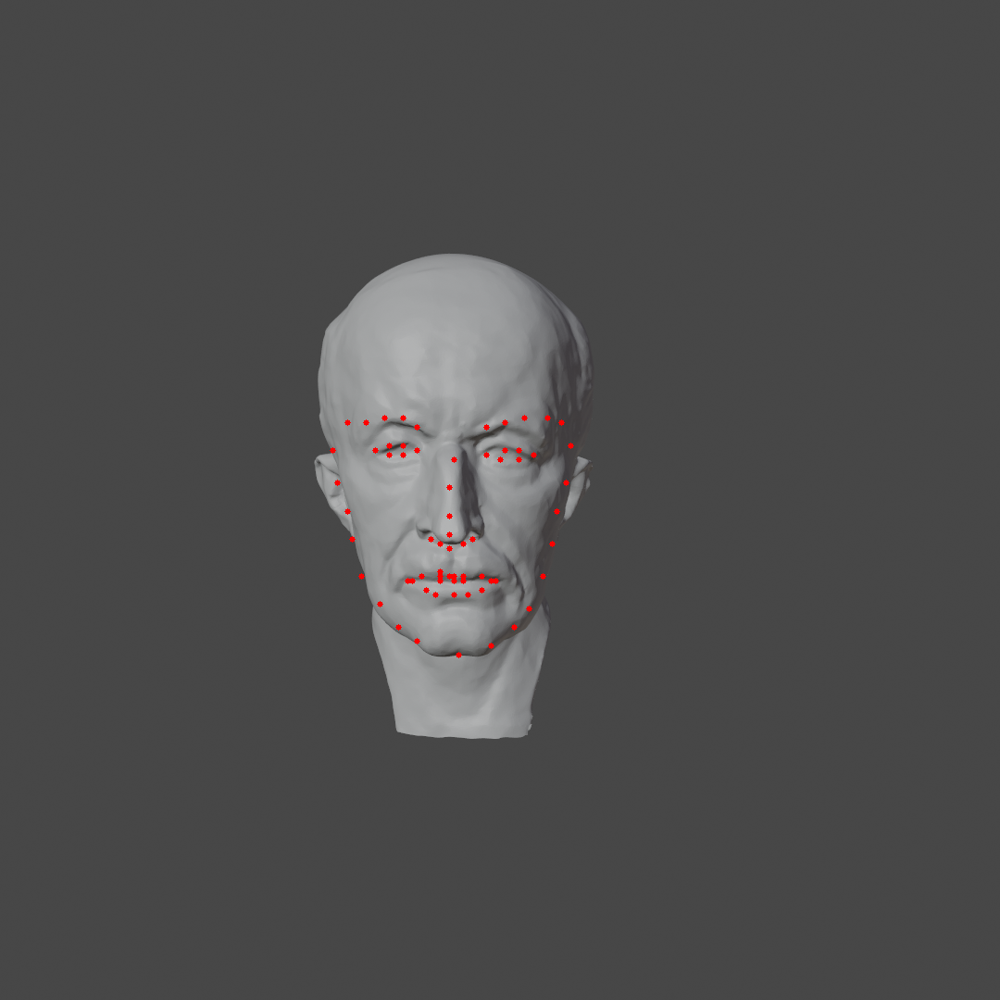

# points2d_projection_mesh
- Input
  - 2D points (e.g. facial lamdmarks) on an image
  - Camera parameters (extrinsic and intrinsic) of the image
  - Aligned 3D mesh to the image
- Output
  - 3D positions (or face id and uv) of the 2D points projected on the 3D mesh

## Sample inputs and outputs
|Input: image and 2D points|Output: 3D positions|
|:---:|:---:|
|||

## Try it
- Step 0: Check original data in `./data/`
    - `max-planck.obj`: A head model of famous guy in physics and sometimes in CG. Gottten from [here](https://github.com/alecjacobson/common-3d-test-models/blob/master/data/max-planck.obj).
    - `max-planck_10k.obj`: A decimated version of the above original mesh. Used for testing with smaller mesh.
    - `rendered.png`: Rendered `max-planck.obj` by Blender.
    - `camera_param.json`: Camera parameters of `rendered.png`.

- Step 1: 2D points preparation
  - You may skip this step. Data is includes in `./data/`
  - Run `python detection.py`. The following files will be generated.
    - `detected.txt`: Detected 2D facial landmark positions.
    - `detected.png`: Visualization of 2D facial landmarks. Not used for the following steps.
  - Dependency: face_alignment, skimage, cv2 and numpy

- Step 2: Projection
  - Run `python projection.py`. Then you will get the following files after a couple of minutes.
    - `projected.ply`: Projected 2D facial landmarks
    - `intersections.json`: Ray intersection information
  - Dependency: trimesh and numpy
    - trimesh is used to load .obj while the main process only depends on numpy

## Algorithm
A ray corresponding to 2D landmark and camera parameters is cast. Then Möller-Trumbore algorithm is used to detect the intersection between ray and triangles. No acceleration technique (e.g., BVH) is used, assuming input 2D points are sparse and not many.
